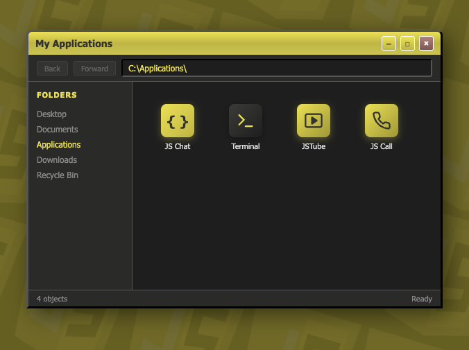
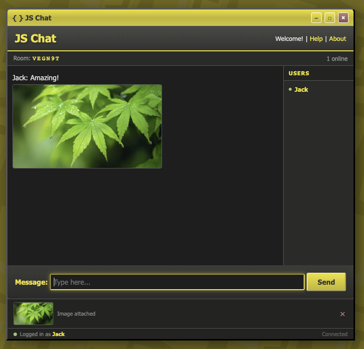
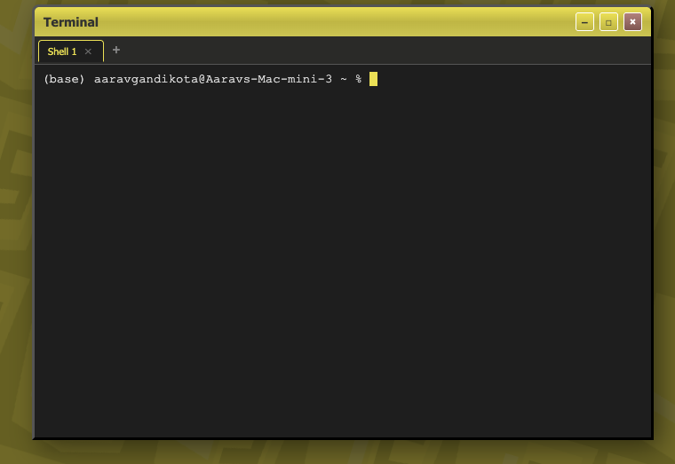
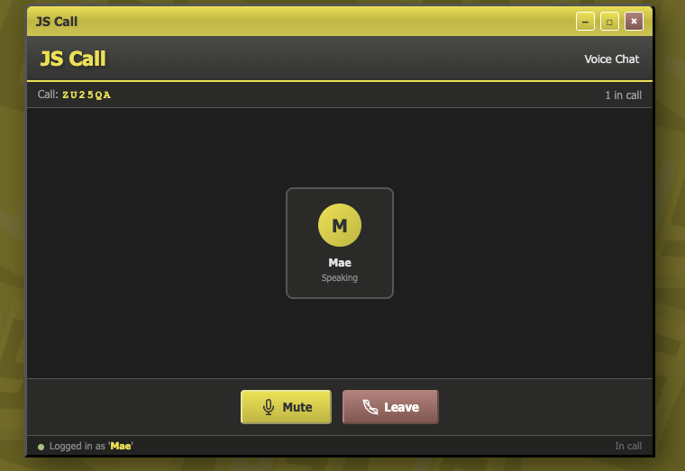

# { } JS OS

A retro Windows 2000-inspired web OS built entirely from scratch with **no frameworks** — just native Node.js, WebSockets, and vanilla JavaScript.

## Screenshots

<p align="center">
  <br>
  <em>Retro file explorer with 4 working apps</em>
</p>

<p align="center">
  <br>
  <em>JS Chat — real-time messaging with image sharing</em>
</p>

<p align="center">
  <br>
  <em>Terminal — real shell sessions with tabs</em>
</p>

<p align="center">
  <br>
  <em>JS Call — WebRTC voice calls with mute/unmute</em>
</p>

## Features

### 4 Fully Working Apps

- **JS Chat** — Real-time chat rooms with invite codes, user lists, image sharing, and push notifications
- **Terminal** — Real terminal sessions powered by node-pty + xterm.js, with tabbed multi-session support
- **JSTube** — YouTube video search and playback, powered by server-side search scraping and YouTube embeds
- **JS Call** — WebRTC voice calls with room codes, mute/unmute, and live user status

### OS Experience

- Retro Windows 2000-style file explorer with clickable app icons
- Boot splash screen with startup sound
- Window open/close animations
- Drifting tiled background pattern
- Windows-style error dialogs with sound effects
- Sound effects for startup, messages, and window actions
- Push notifications when the tab is hidden
- Global username uniqueness across all apps

### Architecture

- **Full OOP** — `BaseApp` class with `JSChatApp`, `TerminalApp`, `JSTubeApp`, `JSCallApp` subclasses. Adding a new app = one class + one line.
- **`Desktop`** orchestrator manages all apps, windows, toasts, and error dialogs
- **`Logger`** class with 12 color-coded categories for browser console debugging
- Everything in a clean file structure:

```
js-chat/
├── server.js                  ← Node HTTP + WebSocket server
├── package.json
└── public/
    ├── index.html             ← HTML structure
    ├── sw.js                  ← Service worker for push notifications
    ├── css/style.css          ← All styles
    ├── js/app.js              ← All client logic (OOP classes)
    ├── lib/                   ← Vendored xterm.js (no CDN)
    ├── images/logo.png        ← JS-themed logo
    └── sounds/                ← Startup, message, window sounds
```

## Stack

**Zero frameworks.** That's the rule.

- **Server:** Native Node.js `http` module + `ws` library + `@lydell/node-pty`
- **Client:** Vanilla ES6 classes, xterm.js (vendored), WebRTC (native browser API)
- **Video:** YouTube search scraping + iframe embeds
- **Audio calls:** WebRTC with STUN server, WebSocket signaling

## Getting Started

```bash
# Clone the repo
git clone https://github.com/TheBOI175/js-chat.git
cd js-chat

# Install dependencies (needs a C compiler for node-pty)
npm install

# Start the server
npm start
```

Open **http://localhost:8080** in your browser.

### Requirements

- **Node.js** v18+ (tested on v24)
- **C compiler** (Xcode Command Line Tools on macOS, build-essential on Linux) — required for node-pty native build
- **Google Chrome** or any modern browser

### Known Issues

- `@lydell/node-pty` is used instead of `node-pty` because the original fails with `posix_spawnp` on Node v24 + macOS ARM
- JSTube search relies on scraping YouTube's search page — may break if YouTube changes their HTML structure
- WebRTC calls require a STUN server (uses Google's public one) — may not work behind strict corporate firewalls

## How It Started

This project started as **PHP Chat** — a single-file PHP app using HTMX for polling and `messages.txt` for storage. PHP's 30-second max execution time killed the streaming approach, so it was rewritten in Node.js with WebSockets. Then rooms were added. Then a terminal. Then a retro OS UI. Then video. Then voice calls. And here we are.

## License

ISC

---

*Built with love, no frameworks, and zero rickrolls (mostly).*
